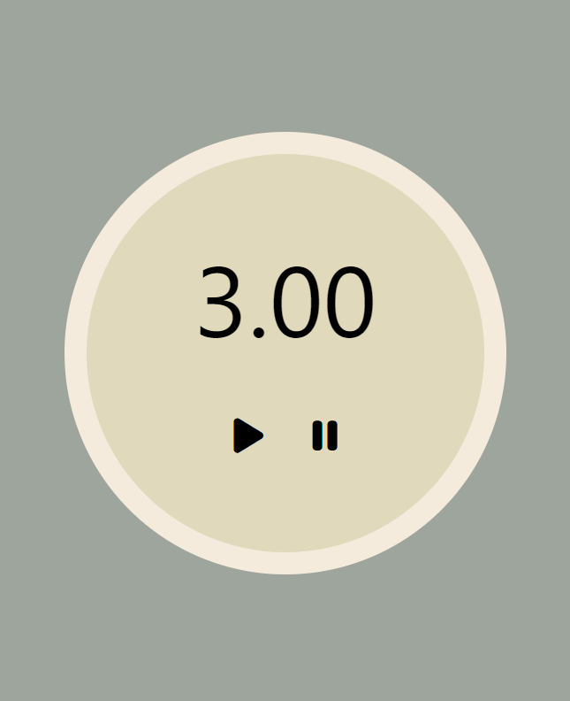

# Timer 

## Overview

The Timer App is a simple and user-friendly application designed to help users track time intervals, and manage tasks efficiently.

## Features

- Set countdown timers for various activities.
- Customize timer durations based on your needs.
- Visual notifications when a timer completes.
- Minimalistic and intuitive user interface.

## Getting Started

### Access 

- [Timer App](https://ed2022.github.io/timer/): The app runs in any modern web browser.
- [Timer Repo](https://github.com/ed2022/timer)

## Usage

1. Open the app in your browser.
2. Set the desired time for your timer.
3. Click the "Start" button to begin the countdown.
4. Visual cues will alert you when the timer reaches zero.

## Technologies Used

- HTML
- CSS
- JavaScript
- SVG 

## Screenshots

## Future Improvements

- Addition of sound effects to know that timer is up, and ablity to have custom made music
- Addition of stopwatch, counting the time forward 
- Additon of alarms 
- Ability to have dark mode

## License

This project is licensed under the MIT License - see the [LICENSE](LICENSE) file for details.

## Acknowledgments

- The app design was inspired by [Udemy].
- Special thanks to [Stephen Grider and Colt Steele ].

---

Happy timing!
